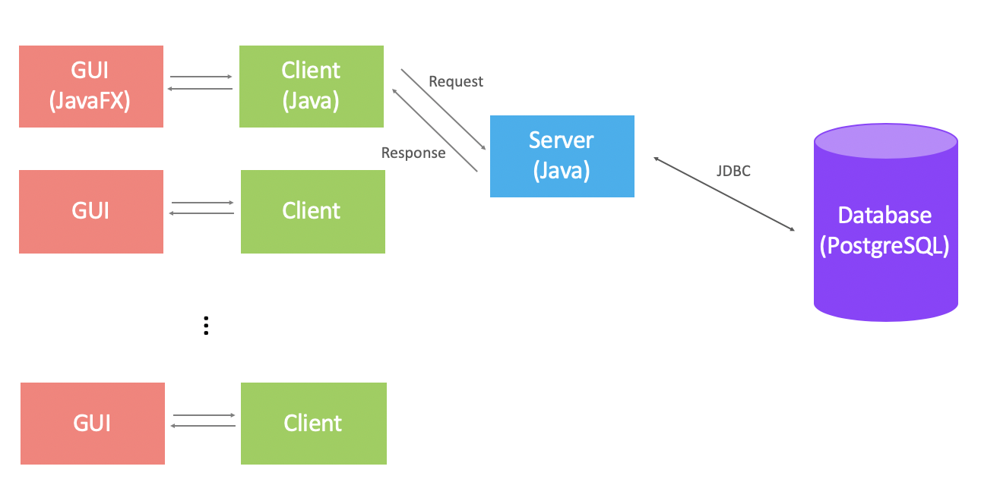

# UNI CHAT - Team Project of Group Seine

## Description of Project

**UNI CHAT** is a messenger program for students at University of Birmingham. The program allows students to login, search and chat to other students by sending text messages, pictures or videos. Students can add and join group chats to talk with group members. Besides, they can also access previous chat histories.

# Program Architecture

The architecture of the program is shown as follows:

The server communicates with the database, and each client communicates with the server. The communication between the server and the database will be based on **JDBC** and the School’s **PostgreSQL** database server. The communication between the server and the clients will be based on **sockets**. And the client user interface(GUI) will be based on **JavaFX**.

## Functions of Program

The **UNI CHAT** program should allow users(i.e., UOB students) to:

1. Create a new account using surname, last name, email, etc.
2. Login to the server using username(the prefix of student email, e.g., jxt967) and password.
3. Search and add other students as contacts, and initiate chat with online contacts.
4. Create new group chats or join existing group chats.
5. Allow a user to view previous chats of which they have been a part of, and searching for specific phrases or other search keys.